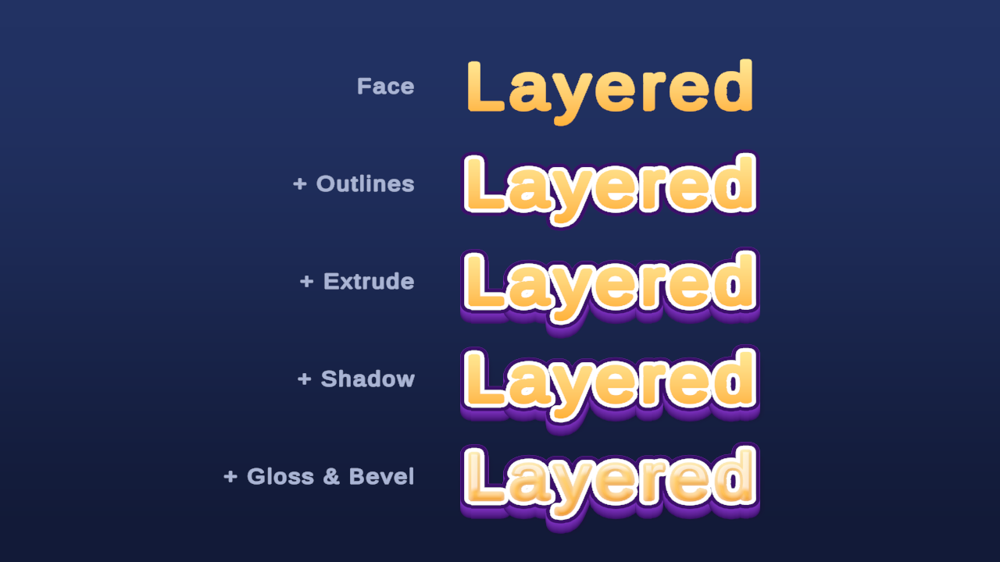
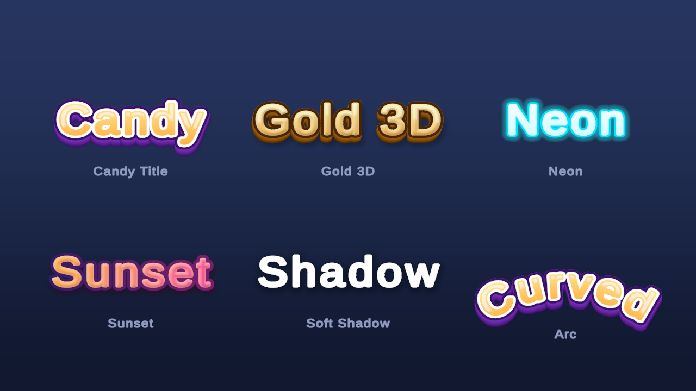
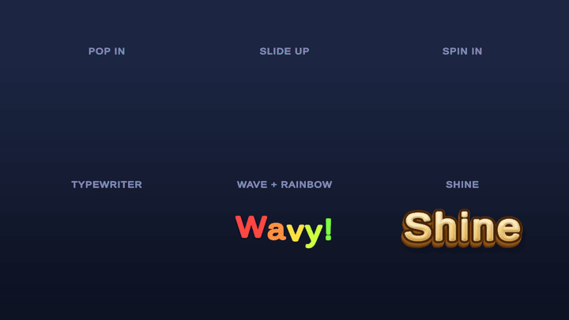
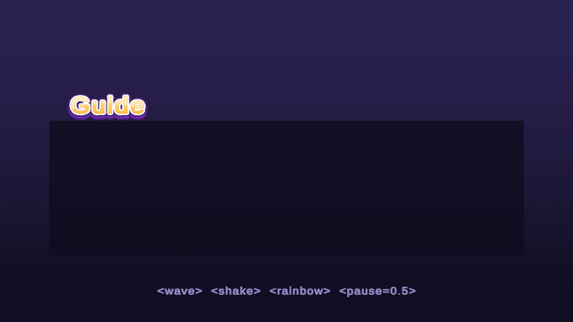
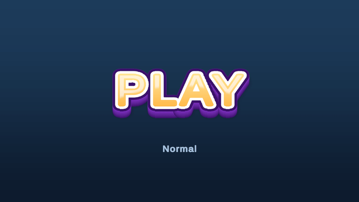
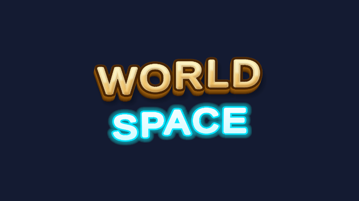

# TMP Text Effects

Stacked outlines, 2.5D extrude, shadows, glossy faces, curved text and per-character animation for
**TextMeshPro**, all on a single text object that renders in one draw call.


Out of the box, TMP's SDF shader gives you **one** outline and **one** underlay. Mobile-game titles usually need
more than that: a white inner outline, a dark outer outline, a chunky extruded side, a soft drop shadow and a
gradient face with a gloss band. The usual fix is to duplicate the text three or four times, or bake it into a
sprite. TMP Text Effects does it on the text you already have, with a style asset you can reuse anywhere.

---

## Features

- **Many layers, one object.** Up to 8 layers per style: outlines, shadows/glows, extrude and face, drawn
  back to front across the *whole* text, so an extrude never covers the next letter's face.
- **2.5D extrude** with front→back colour fade, and a light direction that stays fixed on screen even on curved or
  rotating text.
- **Face styling:** two-colour gradient at any angle, texture, gloss band, inner shadow and inner highlight (bevel).
- **Arc:** bend text up or down along a circle, multi-line included.
- **Text Animator:** per-character transitions (Pop, Fade, Slide, Rotate, Flash, Color Fade) and loops (Wave, Shake,
  Pulse, Rainbow, Shine), with stagger orders and ping-pong loops. It has its own tween system, so there are no
  dependencies.
- **Inline tags:** `<wave>`, `<shake>`, `<pulse>`, `<rainbow>` scope effects to parts of a sentence, `<pause=0.5>`
  holds a typewriter, and punctuation pauses plus a per-character reveal event cover dialogue.
- **Style transitions:** blend between styles (`TransitionTo`), with a drop-in component for button states.
- **Text Counter:** animated numbers with grouping (`1,234,567`), prefix/suffix, allocation-free for whole numbers.
- **UI and world space:** works with `TextMeshProUGUI` and 3D `TextMeshPro`.
- **Batching friendly:** texts sharing a style and font share one material. The per-frame paths allocate nothing.

## Layers

Each style is a stack of layers. The same word, one layer group at a time:



It ships with a few presets you can clone and tweak:



## Animation



Transitions follow a single `Progress` value (0 = hidden, 1 = shown) that the animator plays itself. You can also
drive it from an Animator or Timeline clip, or from any code.

### Inline tags and typewriter



```text
Welcome, traveller! <wave>This part waves</wave>,
<shake>this one trembles</shake>.<pause=0.5> And this is <rainbow>colourful!</rainbow>
```

### Style transitions



### World space



---

## Requirements

- Unity 6 (developed on **6000.3**), tested with **URP**
- TextMeshPro (`com.unity.ugui` 2.x) with TMP Essential Resources imported

## Installation

**Package Manager → + → Add package from git URL…**

```
https://github.com/berkencami/tmp-text-effects.git?path=/Packages/com.berkencami.tmp-text-effects
```

To pin a version, append a tag: `…tmp-text-effects#v0.1.0`.

**Samples:** the scenes behind the images above are in the package's **Samples** tab in Package Manager (*Showcase → Import*).

**Fonts:** for bold multi-outline titles, use a font asset with a generous **atlas padding** (roughly 15–20% of the
sampling point size), since outlines and glows can't grow past it. The package bundles a wide-padding Liberation Sans. To
make one from your own font, select the `.ttf`/`.otf` in the Project window and run
**Tools → TMP Text Effects → Create Wide-Padding Font Asset**.

## Quick start

**In the editor**

- *GameObject → UI (Canvas) → Layered Text – TextMeshPro* (or *3D Object → Layered Text – TextMeshPro*), or
  right-click an existing TMP component → **Add Layered Text**.
- Pick a style in the **Layered Text** inspector. The built-in presets are read-only, so press **Clone** (or **New**)
  for an editable copy and edit its layer list right there. Top of the list = back, bottom = front.
- Add a **Text Animator** for animation. Use the **Presets ▾** menu to start and **▶ Preview** to play it in
  Edit mode.

**From code**

```csharp
using TMPTextEffects;

var layered = text.gameObject.AddComponent<LayeredText>();
layered.Style = myStyle;
layered.ArcAngle = 120f;                          // + bends up, − bends down

var anim = text.gameObject.AddComponent<TextAnimator>();
TextAnimatorPresets.PopIn(anim);
anim.AddEffect(new ShineEffect());
anim.Play();                                      // or anim.Hide(), anim.Complete()
anim.CharacterRevealed += (index, c) => PlayTypeSound(c);
anim.Completed += OnTitleShown;

layered.TransitionTo(pressedStyle, 0.12f);        // smooth style change

var counter = text.gameObject.AddComponent<TextCounter>();
counter.CountTo(1234567, 1.5f);
```

Drive the transition yourself (scrubbing, cutscenes, a custom tween):

```csharp
anim.PlayOnEnable = false;
anim.Progress = t;                                // 0..1, e.g. every frame from your own curve
```

## Components

| Component | What it does |
|---|---|
| `LayeredText` | Renders a TMP text with a `LayeredTextStyle`. Also holds `ArcAngle` and `TransitionTo`. |
| `LayeredTextStyle` | ScriptableObject: the layer stack, gradient space and angle. Owns the materials (as sub-assets). |
| `TextAnimator` | Per-character effects, stagger, loops, inline tags, typewriter pauses and events. Works on plain TMP too. |
| `TextCounter` | Counts a number up or down in a TMP text. |
| `LayeredTextStates` | Normal / Highlighted / Pressed / Disabled style transitions for buttons. |

### Layer types

| Type | Use |
|---|---|
| **Face** | The glyph: colour/gradient, texture, gloss, inner shadow/highlight, shine colour. |
| **Outline** | A dilated copy (thickness). |
| **Shadow** | An offset, optionally blurred copy (zero offset + softness = glow). |
| **Extrude** | The glyph swept along a direction (depth, angle, steps, front→back colour). |

### Animation effects

| Transitions (follow `Progress`) | Loops (run on time) |
|---|---|
| Pop, Fade, Slide, Rotate, Flash, Color Fade | Wave, Shake, Pulse, Rainbow, Shine* |

\* Shine needs a `LayeredText` (it's drawn by the layered shader). Everything else also works on plain TMP.

## How it works

After TMP builds its mesh, every glyph quad is duplicated once per layer in **layer-major** order: all shadows,
then all extrudes, then outlines, then faces. The mesh is handed back to TMP's renderer, so layout, raycasts,
masking and auto-size stay TMP's. Layer parameters live on the material, so one mesh and one material make one
draw call. The shader samples the SDF once per layer (the extrude marches along its sweep), and clamps every sample
to the glyph's own atlas rect so wide effects never pick up neighbouring glyphs.

## Limitations

- **Only the primary font mesh is layered.** Fallback-font glyphs and `<sprite>` render as plain TMP.
- **Transparency is per layer.** Fading a layered text makes each layer translucent separately (outlines show
  through the face mid-fade). Prefer Pop/Slide for layered texts. Fade is fine on plain TMP.
- **Style transitions pair layers by index.** Styles with the same structure (typical button states) blend
  cleanly. Very different stacks cross-fade.
- **Inline tags go through TMP's text preprocessor.** They apply to text set via `text`, not
  `SetText(StringBuilder)` / `SetCharArray`.
- **Outline and glow width are bounded by the font's atlas padding.**

## Repository layout

This repository is the Unity project the package is developed in.

| Path | What |
|---|---|
| `Packages/com.berkencami.tmp-text-effects` | **The package** (Runtime, Editor, Shaders, Presets, Fonts, Tests, `Samples~`). |
| `Assets/Dev/Showcase` | Source of the Showcase sample (scenes, styles, sample scripts). |
| `docs/` | README images. |

Tests: open the project, then **Window → General → Test Runner → EditMode**. To run them from another project, add
the package to `"testables"` in its `Packages/manifest.json`.

## License

[MIT](LICENSE) © Berk Encami
